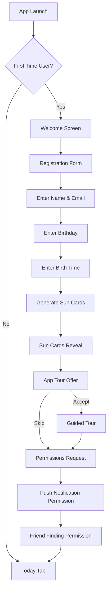
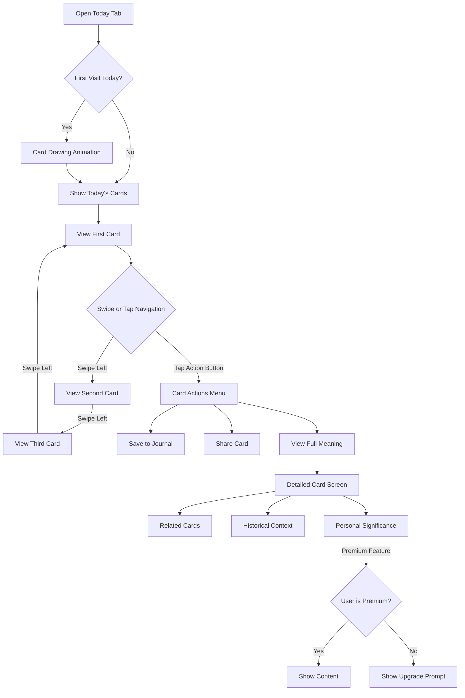
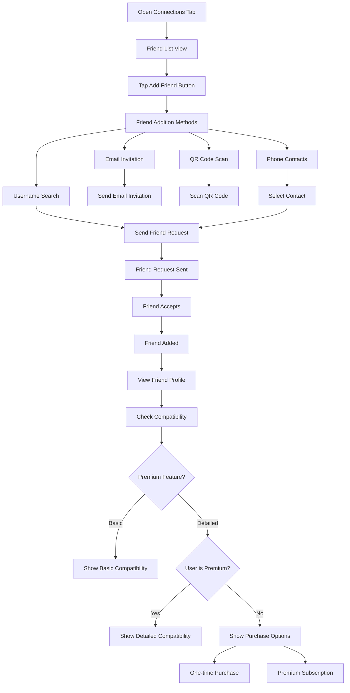
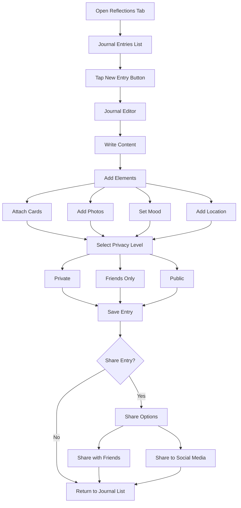
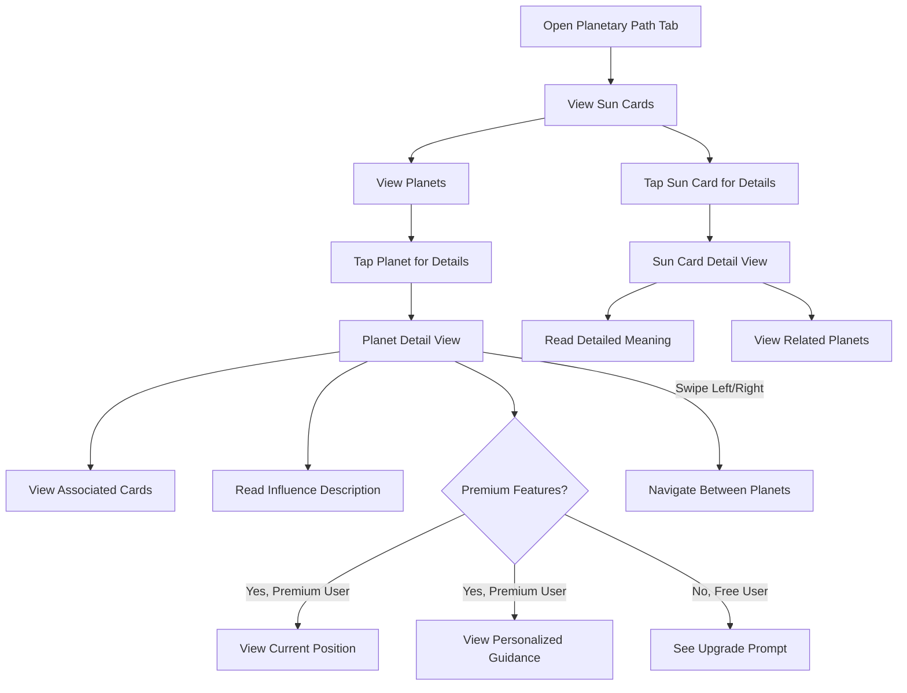
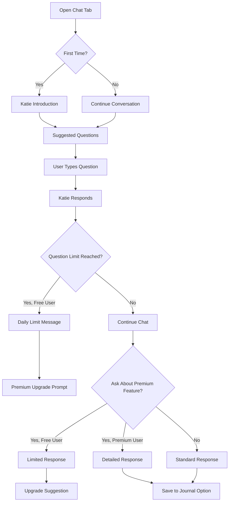

# Cartomancy Mobile App - Product Requirements Document

## 1. Executive Summary

### 1.1 Product Overview
The Cartomancy mobile app is a divination tool that uses a standard deck of playing cards to provide users with personal insights and guidance. Unlike traditional tarot applications, this app leverages the accessibility and familiarity of regular playing cards while providing deep mystical interpretations. The app combines personal divination with social features, allowing users to connect with friends, share readings, and document their spiritual journey.

### 1.2 Target Audience
The primary audience is young adults (18-35) interested in spirituality and self-discovery, with moderate technical proficiency. They're likely to be familiar with tarot or other divination methods and use social features to connect with like-minded individuals. These users are seeking both personal insights and community connections through their spiritual practice.

### 1.3 Key Features
- User registration with birth information that generates personalized Sun Cards
- Daily card readings with interpretations
- Friend connections with compatibility analysis
- Journal entries for personal reflections that can be private or shared
- Planetary path showing celestial influences and associated cards
- AI-powered chat with "Katie The Card Lady" for divination guidance
- Comprehensive meanings for all 52 cards, suits, and numbers

### 1.4 Business Goals
- Implement a freemium model with a basic free tier and premium subscription ($4.99/month)
- Achieve 10% conversion rate from free to premium users within 6 months of launch
- Reach 100,000 active users within the first year
- Establish a dedicated community of cartomancy enthusiasts
- Generate sustainable revenue through subscriptions

## 2. User Personas

### 2.1 The Spiritual Explorer
**Name:** Jordan, 22  
**Occupation:** College student  
**Demographics:** Urban, moderate income, tech-savvy  
**Goals:**
- Discover more about themselves through divination
- Find accessible entry points into spiritual practices
- Connect with others who share similar interests

**Pain Points:**
- Intimidated by complex divination systems like tarot
- Limited budget for spiritual tools and resources
- Unsure how to interpret readings without guidance

**Technical Proficiency:** High - uses multiple apps daily and quickly adopts new technology  
**Behaviors:** Checks horoscope apps daily, follows spiritual influencers on social media, enjoys sharing experiences with friends

### 2.2 The Connected Seeker
**Name:** Alex, 29  
**Occupation:** Marketing professional  
**Demographics:** Suburban, middle income, socially active  
**Goals:**
- Integrate spiritual practices into daily routine
- Share spiritual journey with like-minded friends
- Document insights and growth over time

**Pain Points:**
- Busy schedule makes consistent practice difficult
- Wants community but values privacy for personal insights
- Seeks validation and discussion of interpretations

**Technical Proficiency:** Medium - comfortable with common apps but not an early adopter  
**Behaviors:** Journals regularly, participates in online spiritual communities, enjoys group readings

### 2.3 The Dedicated Practitioner
**Name:** Morgan, 34  
**Occupation:** Wellness coach  
**Demographics:** Mixed urban/rural, stable income, spiritually committed  
**Goals:**
- Deepen understanding of cartomancy symbolism
- Access advanced interpretations and insights
- Build meaningful connections with other practitioners

**Pain Points:**
- Basic apps don't provide enough depth
- Willing to pay for quality but expects value
- Wants personalized experience beyond generic readings

**Technical Proficiency:** Medium-high - uses technology purposefully and selectively  
**Behaviors:** Has established spiritual routines, willing to pay for premium features, mentors others in spiritual practices

## 3. Detailed Feature Requirements

### 3.1 User Registration & Sun Cards

#### 3.1.1 Registration Flow
- Users will provide:
  - Full name
  - Email address and password (with social login options)
  - Date of birth (month, day, year)
  - Time of birth (hour, minute, AM/PM)
  - Optional location of birth
- Email verification required before full access is granted
- Terms of service and privacy policy acceptance required

#### 3.1.2 Sun Cards Generation
- System will algorithmically generate three Sun Cards based on birth information:
  1. Inner Child Card (based on birth day)
  2. Chosen Purpose Card (based on birth month and day)
  3. Highest Self Card (based on birth year and time)
- Each Sun Card will include:
  - Card image
  - Basic meaning
  - Personal significance based on user's birth details
  - Expanded interpretation (premium feature)

#### 3.1.3 Onboarding Experience
- Guided tutorial explaining the app's features
- Introduction to cartomancy basics
- Explanation of the user's Sun Cards
- Tour of the five main tabs
- Option to skip tutorial (accessible later in settings)

### 3.2 Today Tab (Daily Cards)

#### 3.2.1 Daily Card Generation
- Three new cards generated daily at midnight local time
- Cards stored locally for offline access
- Previous days' cards accessible through calendar view (7 days for free users, unlimited for premium)
- Option to manually refresh cards once per day

#### 3.2.2 Card Display
- Full-screen carousel for swiping between daily cards
- Each card includes:
  - High-quality card image
  - Card name and basic attributes
  - Daily interpretation specific to the card's position
  - Relationship to user's Sun Cards (premium feature)
  - Option to save to journal with one tap

#### 3.2.3 Daily Summary
- Combined meaning of the three daily cards
- Daily affirmation based on the cards
- Option to share daily reading to social media or with friends in-app

### 3.3 Connections Tab

#### 3.3.1 Friend Management
- Add friends via:
  - Username search
  - Email invitation
  - QR code scanning
  - Phone contacts (with permission)
- Friend requests with accept/decline functionality
- Friend list with online status indicators
- Ability to categorize friends into groups (premium feature)

#### 3.3.2 Friend Cards Display
- View friends' Sun Cards
- See friends' daily cards (if shared by friend)
- Activity feed of friends' public reflections and readings

#### 3.3.3 Compatibility Feature
- Basic compatibility rating with friends (percentage match)
- Detailed compatibility analysis ($0.99 one-time purchase or included in premium):
  - Card relationship analysis
  - Strength and challenge areas
  - Recommended activities or focus areas
  - Compatibility trends over time

### 3.4 Reflections Tab (Journal)

#### 3.4.1 Journal Entry Creation
- Rich text editor with formatting options
- Ability to attach:
  - Cards from readings
  - Photos
  - Mood indicators
  - Location tags
- Date and time stamping
- Free users: Limited to 10 entries per month
- Premium users: Unlimited entries

#### 3.4.2 Privacy Controls
- Three privacy levels for each entry:
  - Private (visible only to user)
  - Friends (visible to approved connections)
  - Public (visible to all users)
- Batch privacy settings for multiple entries
- Option to change privacy settings after posting

#### 3.4.3 Journal Features
- Search functionality across entries
- Filtering by date, cards, mood, or tags
- Calendar view of entries
- Export functionality (premium feature)
- Insights dashboard showing patterns and trends (premium feature)

### 3.5 Planetary Path Tab

#### 3.5.1 Sun Cards Display
- Prominent display of user's three Sun Cards
- Detailed interpretations of each card
- Option to share individual Sun Cards with friends

#### 3.5.2 Planets Display
- Visual representation of seven planetary influences:
  - Sun (vitality and self-expression)
  - Moon (emotions and intuition)
  - Mercury (communication and intellect)
  - Venus (love and harmony)
  - Mars (action and energy)
  - Jupiter (growth and abundance)
  - Saturn (structure and responsibility)
- Each planet shows associated cards and their relationship to user's Sun Cards

#### 3.5.3 Full-Screen Carousel
- Tap on any planet to open detailed view
- Swipe between planets in full-screen mode
- Each planet screen includes:
  - Planet symbol and name
  - Influence description
  - Associated cards with meanings
  - Current planetary position and significance (premium feature)
  - Personalized guidance based on user's Sun Cards (premium feature)

### 3.6 Chat Tab (Katie The Card Lady)

#### 3.6.1 AI Chat Interface
- Conversational interface with "Katie The Card Lady" character
- Welcome message and suggested questions on first visit
- Message bubbles with clear user/Katie distinction
- Typing indicators and appropriate response timing

#### 3.6.2 Chat Functionality
- Free tier:
  - 5 questions per day
  - Basic card interpretations
  - General guidance questions
- Premium tier:
  - Unlimited questions
  - Detailed card interpretations
  - Personalized guidance based on user's Sun Cards
  - Relationship and compatibility insights
  - Custom spreads and readings

#### 3.6.3 Technical Implementation
- Integration with OpenAI API
- Context awareness of user's:
  - Sun Cards
  - Recent daily cards
  - Basic profile information
- Conversation history storage (7 days for free users, unlimited for premium)
- Option to save insights to journal

### 3.7 Card System

#### 3.7.1 Card Meanings
- Comprehensive meanings for all 52 cards including:
  - Basic interpretation
  - Upright meaning
  - Reversed meaning (premium feature)
  - Keywords and themes
  - Elemental associations

#### 3.7.2 Suit Meanings
- Hearts: Emotions, relationships, love, healing
- Diamonds: Material world, finances, career, manifestation
- Clubs: Energy, action, growth, creativity
- Spades: Challenges, transformation, intellect, truth

#### 3.7.3 Number Meanings
- Ace: New beginnings, potential, opportunity
- Two: Balance, partnership, duality
- Three: Creation, expression, growth
- Four: Stability, foundation, structure
- Five: Change, conflict, adaptation
- Six: Harmony, responsibility, adjustment
- Seven: Reflection, assessment, spirituality
- Eight: Power, regeneration, movement
- Nine: Completion, fulfillment, integration
- Ten: Culmination, transition, ending
- Jack: Youth, student, messenger
- Queen: Nurturing, intuition, inner wisdom
- King: Mastery, authority, leadership

#### 3.7.4 Card Detail View
- Access by tapping any card in the app
- Full-screen high-quality card image
- Complete meaning and interpretations
- Historical and cultural context (premium feature)
- Related cards and combinations
- Journal entries associated with this card

## 4. User Experience & Interface Design Guidelines

### 4.1 Design Principles

#### 4.1.1 Core Principles
- **Intuitive Navigation**: Users should instinctively understand how to move through the app
- **Mystical Yet Modern**: Balance spiritual aesthetics with contemporary design
- **Emotional Connection**: Design should evoke feelings of wonder and insight
- **Accessibility**: Features should be discoverable and usable by all target users
- **Consistency**: Maintain visual and interaction consistency throughout the app

#### 4.1.2 Visual Identity
- **Color Palette**:
  - Primary: Deep purple (#6366f1) - representing intuition and spiritual awareness
  - Secondary: Soft gold (#f5d76e) - representing illumination and wisdom
  - Accent colors: Teal (#4ecdc4), Rose (#ff6b6b), Midnight blue (#2c3e50)
  - Neutrals: Various grays, off-whites, and soft blacks
- **Typography**:
  - Primary font: Montserrat (headings and emphasis)
  - Secondary font: Open Sans (body text and UI elements)
  - Special display font: Cormorant Garamond (for card names and special elements)
- **Iconography**:
  - Custom icons for navigation and key features
  - Consistent style with slightly mystical elements
  - Clear meaning without text when possible

#### 4.1.3 Layout Guidelines
- Generous white space to create a sense of calm
- Card-based UI elements with subtle shadows
- Consistent margins and padding throughout
- Responsive layouts that adapt to different device sizes
- Bottom navigation always accessible

### 4.2 Interaction Design

#### 4.2.1 Navigation Patterns
- Bottom tab bar for primary navigation between the five main sections
- Swipe gestures for cards and carousels
- Back button consistently placed in top left
- Important actions accessible within thumb reach
- Minimize depth of navigation (no more than 3 levels deep)

#### 4.2.2 Animations and Transitions
- Subtle card flip animations for revealing meanings
- Smooth transitions between screens (300ms duration)
- Gentle pulse animations for interactive elements
- Card dealing animation for daily cards
- Loading states that maintain the mystical theme

#### 4.2.3 Feedback Mechanisms
- Haptic feedback for important actions
- Visual confirmation for completed actions
- Error messages that are helpful and non-technical
- Toast notifications for background processes
- Progress indicators for longer operations

### 4.3 Screen-Specific Guidelines

#### 4.3.1 Onboarding Screens
- Minimalist design focusing on key information
- Progressive disclosure of features
- Clear indicators of progress through onboarding
- Engaging illustrations of key concepts
- Option to skip visible but not emphasized

#### 4.3.2 Today Tab
- Focus on the cards with minimal distractions
- Clear date indication
- Intuitive carousel navigation
- Prominent card meanings
- Easy access to save or share functionality

#### 4.3.3 Connections Tab
- Visual distinction between different friend statuses
- Clear compatibility indicators
- Easily accessible friend management
- Engaging empty states for users with no connections
- Intuitive invitation process

#### 4.3.4 Reflections Tab
- Clean, distraction-free writing interface
- Clear privacy status indicators
- Visually organized journal entries
- Intuitive date navigation
- Prominent creation button

#### 4.3.5 Planetary Path Tab
- Visually engaging planetary representation
- Clear relationship between planets and cards
- Intuitive navigation between planets
- Visual hierarchy emphasizing Sun Cards
- Smooth transitions to detailed views

#### 4.3.6 Chat Tab
- Conversational interface following messaging conventions
- Clear distinction between user and Katie
- Personality expressed through visual design
- Suggested questions easily accessible
- Unobtrusive premium feature indicators

### 4.4 Responsive Design

#### 4.4.1 Device Support
- Optimize for iPhone and Android smartphones (primary)
- Adapt layouts for tablets (secondary)
- Consider landscape orientation for card detail views
- Ensure touch targets are appropriately sized (minimum 44x44 points)

#### 4.4.2 Adaptation Guidelines
- Fluid layouts that adjust to screen dimensions
- Consistent experience across devices while leveraging device-specific capabilities
- Appropriate font scaling for readability
- Consideration for different notch designs and safe areas
- Testing on representative device range

### 4.5 Accessibility Guidelines

#### 4.5.1 Visual Accessibility
- Minimum contrast ratio of 4.5:1 for all text
- Support for dynamic type and system font size changes
- Alternative text for all images and cards
- Color not used as the sole indicator of meaning
- Support for Dark Mode

#### 4.5.2 Interaction Accessibility
- Support for screen readers (VoiceOver and TalkBack)
- Keyboard navigation support for external keyboards
- Sufficient touch target size (minimum 44x44 points)
- Reduced motion option for animations
- Voice control compatibility

## 5. User Flows

### 5.1 Registration & Onboarding Flow

### 5.2 Daily Card Reading Flow

### 5.3 Adding Friends & Checking Compatibility Flow

### 5.4 Creating & Sharing Journal Entries Flow

### 5.5 Exploring Planetary Path Flow

### 5.6 Chatting with Katie Flow

## 6. Technical Requirements

### 6.1 Platform Support
- iOS 13.0 and above
- Android 9.0 (API level 28) and above
- React Native framework for cross-platform development
- Expo managed workflow for simplified development

### 6.2 Backend Requirements
- Firebase Authentication for user management
- Firebase Firestore for data storage
- Firebase Cloud Functions for server-side logic
- Firebase Cloud Storage for image storage
- Firebase Analytics for usage tracking

### 6.3 API Integrations
- OpenAI API for Katie The Card Lady chat functionality
- Apple App Store and Google Play billing APIs for in-app purchases
- Optional social media sharing APIs (Facebook, Twitter, Instagram)

### 6.4 Offline Functionality
- Core features must function without internet connection:
  - Viewing daily cards
  - Reading card meanings
  - Accessing previously loaded Sun Cards
  - Creating journal entries
- Data synchronization when connection is restored
- Clear indicators of offline status and limited functionality

### 6.5 Performance Requirements
- App launch time under 3 seconds on mid-range devices
- Smooth animations (60fps) for card interactions
- Maximum 1.5 second response time for database operations
- Image optimization for faster loading and reduced storage
- Battery usage optimization, especially for background processes

### 6.6 Security Requirements
- Secure storage of user credentials
- Encryption of sensitive user data
- Compliance with GDPR and CCPA privacy regulations
- Regular security audits and updates
- Secure API communication with SSL/TLS

### 6.7 Testing Requirements
- Unit testing for core functionality
- Integration testing for feature interactions
- UI testing across multiple device sizes
- Performance testing on target devices
- Beta testing with representative user group

## 7. Monetization Strategy

### 7.1 Freemium Model Overview
The Cartomancy app will implement a freemium model with a free tier offering core functionality and a premium subscription unlocking enhanced features.

### 7.2 Free Tier Features
- Basic user registration and Sun Cards generation
- Three daily cards with basic interpretations
- Limited journal entries (10 per month)
- Basic friend connections and profile viewing
- Basic compatibility ratings
- Access to planetary path with limited information
- Limited chat with Katie (5 questions per day)
- Standard card meanings and interpretations

### 7.3 Premium Subscription ($4.99/month)
- Unlimited journal entries
- Advanced compatibility reports
- Detailed Sun Card interpretations
- Current planetary positions and personalized guidance
- Unlimited chat with Katie with advanced features
- Reversed card meanings and advanced interpretations
- Historical and cultural context for cards
- Ad-free experience
- Priority customer support

### 7.4 Individual Purchases
- Detailed compatibility report ($0.99) as alternative to subscription
- Special card designs and themes ($1.99-$4.99)
- Premium reading spreads ($2.99)

### 7.5 Subscription Management
- Easy subscription management through app settings
- Clear explanation of benefits before purchase
- Seamless integration with App Store and Google Play billing
- Prorated refunds for cancellations
- Special offers for long-term commitments (annual option at $49.99)

### 7.6 Conversion Strategy
- Strategic feature limitations that encourage upgrades
- Free trials of premium features (3-day trial)
- Limited-time promotions for new users
- Referral bonuses for premium conversions
- Targeted upgrade prompts based on user behavior

## 8. Success Metrics

### 8.1 User Acquisition Metrics
- Total downloads
- User registration completion rate
- Cost per acquisition
- Acquisition channel effectiveness
- Onboarding completion rate

### 8.2 Engagement Metrics
- Daily active users (DAU)
- Monthly active users (MAU)
- DAU/MAU ratio (stickiness)
- Session frequency and duration
- Feature usage rates
- Retention rates (Day 1, Day 7, Day 30)

### 8.3 Monetization Metrics
- Conversion rate to premium
- Average revenue per user (ARPU)
- Lifetime value (LTV)
- Subscription renewal rate
- Churn rate
- Revenue breakdown by feature

### 8.4 Social Metrics
- Average number of friends per user
- Invitation send/accept rates
- Content sharing frequency
- Public journal entry engagement

### 8.5 Performance Metrics
- App crash rate
- API response times
- Screen load times
- Battery usage
- Data consumption

### 8.6 Target KPIs
- 100,000 downloads in first 6 months
- 40% Day 1 retention
- 20% Day 30 retention
- 10% conversion to premium subscription
- Average 4.5+ star rating in app stores
- 5+ average sessions per week for active users

## 9. Implementation Timeline

### 9.1 MVP Phase (Months 1-2)
- **Week 1-2**: Project setup and architecture
- **Week 3-4**: User registration and Sun Cards generation
- **Week 5-6**: Today tab with daily cards functionality
- **Week 7**: Connections tab with basic friend management
- **Week 8**: Basic compatibility feature
- **Week 9**: Reflections tab with journal functionality
- **Week 10**: Planetary path with basic information
- **Week 11**: Subscription implementation and testing
- **Week 12**: Bug fixes, performance optimization, and launch preparation

**MVP Deliverables:**
- Complete user registration and onboarding
- Daily cards generation and display
- Basic friend connections and compatibility
- Journal entry creation with privacy controls
- Planetary path with Sun Cards
- Basic card meanings system
- Freemium model implementation

### 9.2 Phase 2 (Months 3-4)
- **Week 13-14**: Katie The Card Lady AI chat implementation
- **Week 15-16**: Enhanced social features
- **Week 17-18**: Advanced compatibility analysis
- **Week 19-20**: Journal insights and patterns
- **Week 21-22**: Expanded planetary guidance
- **Week 23-24**: Additional premium features
- **Week 25-26**: Performance optimization and scaling
- **Week 27-28**: Marketing features and sharing capabilities
- **Week 29-30**: Final testing and full launch preparation

**Phase 2 Deliverables:**
- AI chat functionality
- Enhanced social features
- Advanced premium features
- Performance optimizations
- Full feature set ready for public launch

### 9.3 Post-Launch (Months 5+)
- Ongoing feature enhancements based on user feedback
- Seasonal content and special events
- Community building initiatives
- Additional monetization opportunities
- Localization for international markets
- Advanced analytics implementation

## 10. Appendix

### 10.1 Glossary of Terms
- **Cartomancy**: Divination using playing cards
- **Sun Cards**: Three special cards derived from birth information
- **Compatibility**: Analysis of relationship dynamics between users
- **Premium Features**: Enhanced functionality available through subscription

### 10.2 References
- Playing card meanings and interpretations
- Astrological correspondences
- Technical specifications for React Native and Firebase
- App Store and Google Play guidelines

### 10.3 Open Questions & Considerations
- Potential for future expansion to include additional divination methods
- Localization strategy for international markets
- Advanced AI capabilities and limitations
- Community moderation needs as user base grows